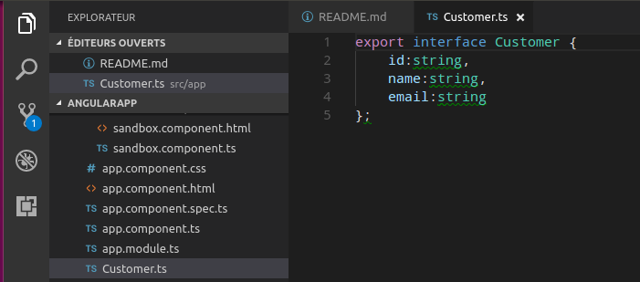
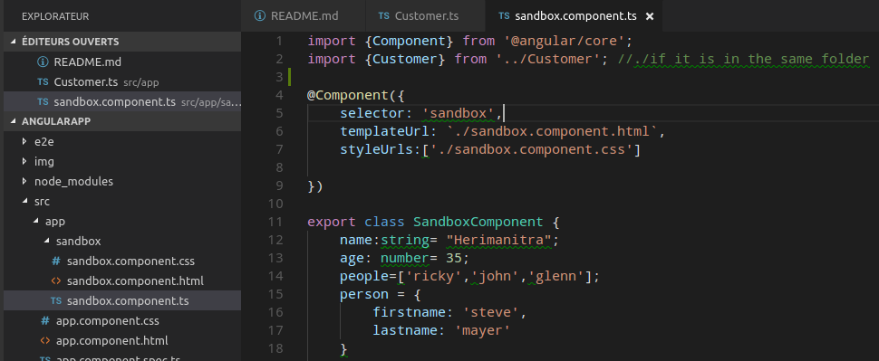

# angularApp

From OO programmer perspective.

Components are pieces (skeletons) of your web application. It is typically contained in a folder with usual files (html, css and typescript).
A component itself can be viewed as an "hybrid" class that can call "pure" class stored in a  `ts.` format. 

### Example:

Above, we have a customer class with differents fields. Once exported, we can use it in any of our components. Below, we exported it to the `sandbox component` you've already defined:

### Creation:

Component creation is easy, just enter the following commands on your CLI:

`$ ng g component componentName`

`componentName` is automatically imported and added (`@NgModule`) into your  `app.module` ts file.